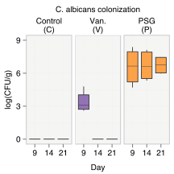
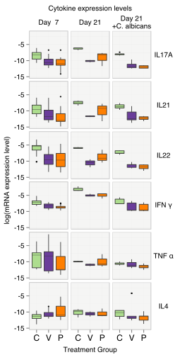
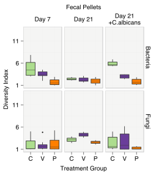
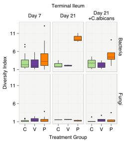

---
**Descriptive Analysis**

Figure 2 | Exploring the effects of PSG (P) and vancomycin (Van., V) relative to controls on:
!TOC

Statistical analysis: In each boxplot, the upper and lower hinges correspond to the 25th and 75th percentiles of the data, also known as the interquartile range (IQR). The upper and lower whiskers extend from the hinge to the highest value within 1.5 times the IQR. Points beyond the end of the whiskers denote outliers. Asterisks, when present, denote statistically significant differences relative to controls. Findings were considered statistically significant when the 99.6% bootstrap confidence intervals (CI) of the normalized mean difference (Welch’s statistic) between the antibiotic group and the controls did not include zero. The 99.6% bootstrap CIs were computed over 10,000 resamples and included a conservative correction for 6 simultaneous hypotheses corresponding to the 6 cytokines. Results shown are the combined data from at least two independent experiments of 3–5 mice each.
(Please see [Methods]({{ site.baseurl }}/methods.html) and the main paper for additional description.)

---
#### a. _C. albicans_ colonization

Levels of log transformed colony forming units per gram (CFU/g) of _C. albicans_ from faecal pellets sampled on days 9, 14 and 21 from controls (green), vancomycin-treated (violet) and PSG-treated (orange) mice.

---

#### b. Cytokine expression levels
mRNA expression levels of the 6 cytokines measured from segments of the terminal ileum sampled on days 7 and 21. Day 21 +_C. albicans_ and Day 21 respectively indicate mice groups with and without exposure to _C. albicans_ gavage.

---
#### c. Microbiome diversity
Bacterial and Fungal diversity on days 7 and 21 both with (Day 21 +_C. albicans_) and without _C. albicans_ exposure (Day 21) in the faecal pellets and the terminal ileum. Diversity was computed using the inverse Simpson index.

