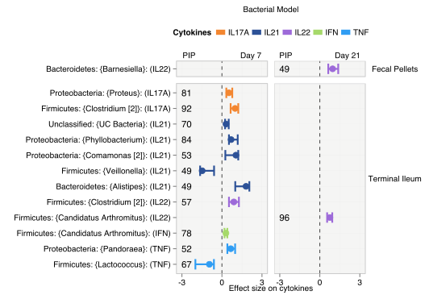
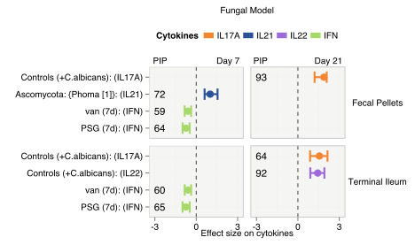
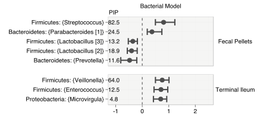
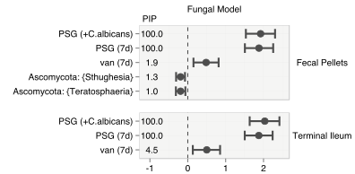

---
**Effect Sizes across the cytokine and colonization models.**

Figures 5, 6 | Results from BMA models computing:
!TOC

---
#### Effect of Microbiome and antibiotic treatment on host cytokine mRNA expression.
Results from BMA linear regression ensembles that explain cytokine expression level as a function of the microbiome and antibiotic treatment are shown. A separate model was estimated for each cytokine. Panels (a). and (b). show findings in the bacterial and fungal models, respectively. We show only the effects that were statistically significant i.e. the corresponding Bayesian 95% CIs did not include zero. The effect sizes and the Bayesian 95% CIs of the top consistent and significant variables are presented. A higher value of PIP (expressed in %) indicates that the variable is consistently associated with cytokine expression levels across the space of models explored in BMA.

---
#### Effect of Microbiome, cytokine expression and antibiotic treatment on _C. albicans_ colonization.
Results from  Findings from the bacterial models are presented in panels (a). (faecal pellets) and (b). (terminal ileum) while those from the fungal models are presented in panels (c). (faecal pellets) and (d). (terminal ileum). From left to right, each panel consists of (left) a plot of effect size vs. PIP, (middle)

Panels below show the 95% Bayesian CI of effect sizes computed from BMA linear regression ensembles that explain colonization in log(CFU/g) as a function of the microbiome, cytokine expression levels and antibiotic treatment. All analyses were performed at the genus level. Plots show only the top consistent variables that attained the highest PIPs and whose effects on _C. albicans_ colonization were statistically significant i.e. the corresponding Bayesian 95% CIs did not include zero.

<!--Google Analytics Code-->

