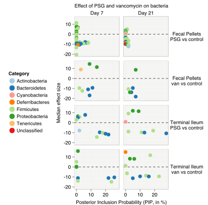
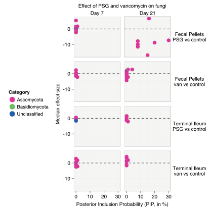
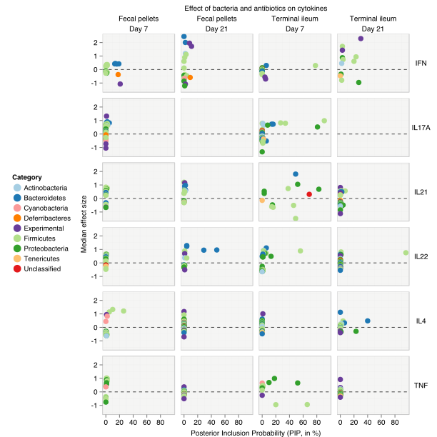
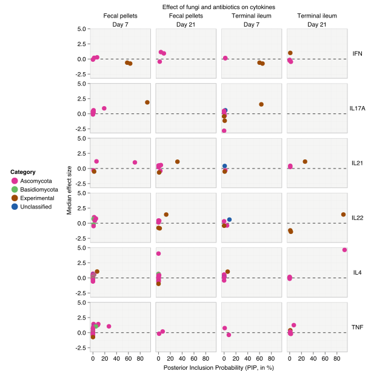
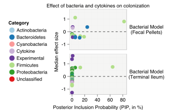
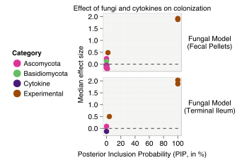

---
**Visualizing Heterogeneity**

Figure 3a, 3b, 4a, 4b | Heterogeneity in effects across the antibiotic, cytokine and colonization models.

Plot below show the median effect size of each variable (bacteria, fungi, experimental) against its posterior inclusion probability (PIP) in the following BMA models:
!TOC

PIP is expressed in %. The effect size of a microbe is its regression coefficient in the model and depends on its relative abundance under antibiotic treatment (PSG or Van.) relative to controls (Cntrl), after adjusting for all the other covariables in the model. We show only the effects that were statistically significant i.e. the corresponding Bayesian 95% CIs did not include zero. Higher PIPs indicate higher consistency in antibiotic effects. PIPs can range from 0% (not consistent) to 100% (very highly consistent). All models were built at the genus level. Each point in the graph denotes a genus coloured by its phylum membership.

---
#### Antibiotic models

---

#### Cytokine models

---
#### Colonization models

