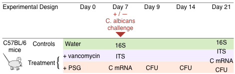

---

!TOC

---
###### Mouse Experiments
Male C57BL/6 mice (Taconic Farms) were housed in high efficiency particulate air (HEPA) filtered cages with sterilized bedding and fed autoclaved chow and water ad libitum throughout the experiment. Prior to antibiotic treatment, mouse faecal pellets were plated onto Sabouraud agar containing chloramphenicol and streptomycin to verify that the mice were not colonized with Candida spp. The mice were divided into a control and two treatment groups. The following antibiotics were added to the drinking water of mice in the two treatment groups and continued for the duration of the experiment: a) vancomycin (0.5 mg/ ml), and b) a combination of penicillin (1.5 mg/ml), streptomycin (2 mg/ml), and gentamicin (0.1 mg/ml) (PSG) (Figure 1). After 7 days of antibiotic treatment, 105 yeast cells of C. albicans SC5314 were administered by gavage to some of the mice. Others were continued on antibiotic treatment alone and were not colonized. All colonized mice were quarantined to prevent cross-infection. The mouse studies were carried out in accordance with the National Institutes of Health guidelines for the ethical treatment of animals. This protocol was approved by the Institutional Animal Care and Use Committee of the Los Angeles Biomedical Research Institute at Harbor-UCLA Medical Center.

 

---
###### Sample Collection
Sample collection, DNA and RNA extraction. Experiments were initiated with 10 to 12 mice in each control and treatment group. On days 7, 9, 14 and 21, freshly obtained faecal pellets were weighed, homogenized, and then quantitatively cultured on Sabouraud agar containing chloramphenicol and streptomycin to measure the number of C. albicans CFUs. On days 7 and 21, 3 to 5 mice per treatment group were humanely euthanized and segments of their terminal ileum were harvested. A portion of these segments was cut lengthwise and vortexed briefly in PBS to separate the loosely adherent material from the mucosa-associated contents. Microbial DNA was isolated from these contents with the QIAamp DNA Stool Minikit (Qiagen) using the protocol from Wu et al.46 modified to include a bead-beating step for more efficient lysis and improved nucleic acid recovery. Autoclaved mouse chow was also processed to evaluate the contribution of ingested fungal and bacterial DNA. A separate portion of the ileum segments were immersed in RNAlater (Qiagen) immediately after collection, and RNA was isolated using the RiboPure RNA Purification Kit (Life Technologies). After preparing cDNA using the RETROscript reverse transcriptase kit (Life Technologies), mRNA expression levels of IL-17A, IL-22, IL-21, TNF-a, IFN-c and IL-4 were measured by real-time PCR and normalized using GAPDH by the DDCt method. At a minimum, samples and data were available from at least 3–5 mice for each treatment arm and for each experiment. Each experiment was repeated at least twice.
 

---
###### Amplification and sequencing
Primer pairs targeting the V3–V5 region of bacterial 16S rRNA gene and fungal internal transcribed spacer (ITS) region were used to amplify the extracted microbial DNA. All amplified sequences contained 10 bp unique barcodes and 454 FLX Titanium adaptors. The primer sequences and amplification strategy are described in [Primers and barcodes for 16S amplification]({{ site.baseurl }}/pcr_primers.html)  
 

---
###### Bioinformatics
Taxonomic classification of the 16S and ITS sequences was performed using YAP, a distributed bioinformatics workflow, described in [The YAP workflow for taxonomic classification]({{ site.baseurl }}/yap_workflow.html)  
 

---
###### Statistics
Steps involved in data processing and the detailed specifications of the Bayesian models used in the analysis of the experimental data are described in [Ensemble Bayesian modeling]({{ site.baseurl }}/bayesian_ensemble.html)  
 

<!--Google Analytics Code-->

