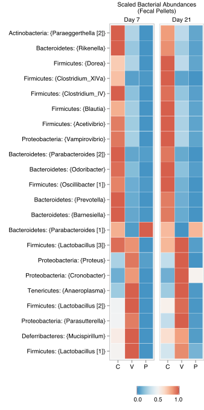
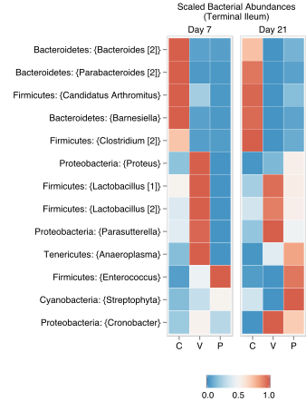
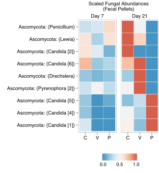
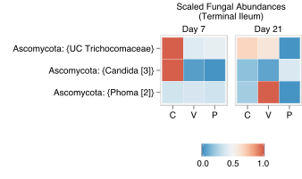

---
**Effect of antibiotics on the microbiome**

Figure 3c, 3d, 4c, 4d | Effect of antibiotics on the bacterial and fungal microbiome.

Results from BMA logistic regression ensembles exploring the antibiotic and bacterial microbiome interface are shown below. The heatmaps show the scaled relative abundances (scaled to the range 0–1) of the:
!TOC

with the top consistent and significant differences across the PSG (P), vancomycin (Van., V) and control (C ) groups on days 7 and 21. Numbers in square brackets denote distinct sequence clusters that were mapped to the same genus but could not be collapsed since they were more than 3% dissimilar from each other. UC denotes sequence clusters that did not have a genus level classification in any of the databases (NCBI, SILVA) we used as reference for taxonomic classification and could not be resolved using the Megablast algorithm. Each genus is annotated with its phylum-level label in the heatmaps. 

---
#### Bacteria

---

#### Fungi

